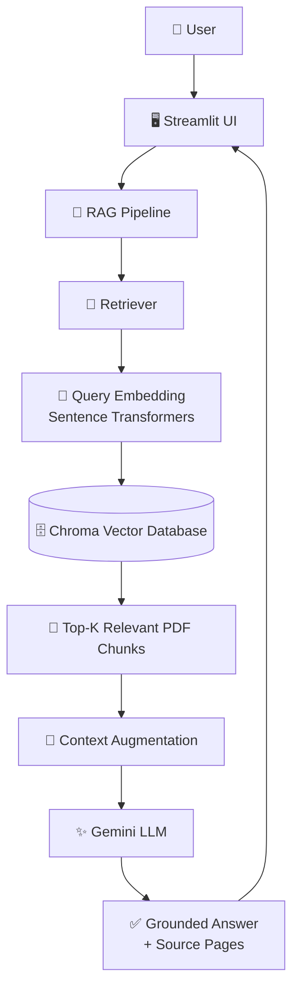
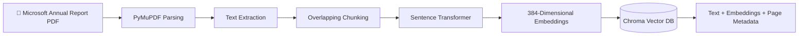

# 📄 Microsoft Annual Report — End-to-End RAG Pipeline

> An end-to-end Retrieval-Augmented Generation (RAG) application that enables users to ask natural-language questions about Microsoft's 2025 Annual Report and receive context-grounded answers with source-page references.


---

## 🎯 Project Overview

Large financial and corporate reports contain valuable information, but manually searching hundreds of pages can be slow and inefficient.

This project implements an end-to-end **Retrieval-Augmented Generation (RAG)** pipeline for Microsoft's 2025 Annual Report.

The system:

1. Extracts text from the PDF.
2. Splits the extracted text into overlapping chunks.
3. Converts the chunks into numerical embeddings.
4. Stores embeddings and metadata in a persistent Chroma vector database.
5. Converts a user's question into a query embedding.
6. Performs semantic similarity search to retrieve relevant report sections.
7. Supplies the retrieved context to Gemini.
8. Generates a grounded answer.
9. Displays the answer, source pages, and retrieved evidence through a Streamlit interface.

---

## ✨ Key Features

- 📄 PDF text extraction with PyMuPDF
- ✂️ Overlapping document chunking
- 🧠 Transformer-based semantic embeddings
- 🔎 Semantic vector search
- 🗄️ Persistent Chroma vector database
- 🤖 Gemini-powered grounded answer generation
- 📚 Source-page metadata tracking
- 🔍 Expandable retrieved evidence
- 🖥️ Interactive Streamlit web interface
- 🔐 Environment-variable based API-key management
- ♻️ Persistent vector storage to avoid unnecessary re-indexing

---

## 🏗️ System Architecture



### Indexing Pipeline



---

## 🔄 How RAG Works in This Project

### 1. Document Ingestion

The annual report is parsed page-by-page using **PyMuPDF**.

Each extracted page retains its page number so that retrieved information can later be traced back to its source.

### 2. Chunking

Long page text is divided into smaller overlapping chunks.

The baseline implementation uses:

- Chunk size: `1000` characters
- Chunk overlap: `200` characters

Overlap helps preserve contextual information across chunk boundaries.

### 3. Embedding Generation

Each text chunk is converted into a dense numerical vector using:

`all-MiniLM-L6-v2`

The model produces **384-dimensional embeddings** representing semantic meaning.

### 4. Vector Storage

The embeddings are stored in a persistent **Chroma** collection together with:

- Unique chunk ID
- Original chunk text
- Page-number metadata
- Embedding vector

Persistent storage allows the vector index to survive application restarts.

### 5. Semantic Retrieval

When the user asks a question:

```text
What does Microsoft say about artificial intelligence?
```

the question is converted into an embedding using the same embedding model.

Chroma then performs similarity search between the query vector and stored document vectors.

The most semantically relevant chunks are returned.

### 6. Context Augmentation

The retrieved report sections are assembled into a context block containing their page information.

This context is supplied to the LLM together with the user's question.

### 7. Grounded Generation

Gemini receives instructions to answer using **only the retrieved report context**.

If the retrieved evidence is insufficient, the model is instructed to say that there is not enough information rather than inventing unsupported facts.

### 8. Evidence Presentation

The Streamlit application displays:

- Generated answer
- Retrieved source pages
- Expandable retrieved evidence

This makes the retrieval process more transparent to the user.

---

## 🛠️ Technology Stack

| Layer | Technology |
|---|---|
| Programming Language | Python |
| PDF Parsing | PyMuPDF |
| Embeddings | Sentence Transformers |
| Embedding Model | all-MiniLM-L6-v2 |
| Vector Database | ChromaDB |
| LLM | Google Gemini |
| LLM SDK | Google GenAI |
| User Interface | Streamlit |
| Environment Management | Python virtual environment |
| Secret Management | python-dotenv |
| Testing | pytest |
| Version Control | Git |
| Repository Hosting | GitHub |

---

## 📂 Project Structure

```text
03-pdf-rag-pipeline/
│
├── src/
│   ├── ingestion.py
│   ├── chunking.py
│   ├── embeddings.py
│   ├── vector_store.py
│   ├── retrieval.py
│   └── rag.py
│
├── data/
│   └── documents/
│       └── [annual report PDF - not committed]
│
├── tests/
│
├── app.py
├── test_gemini.py
├── test_ingestion.py
├── test_retrieval.py
├── test_vector_search.py
├── test_rag.py
│
├── requirements.txt
├── .env.example
├── .gitignore
└── README.md
```

---

## 🚀 Running the Project Locally

### 1. Clone the repository

```bash
git clone <repository-url>
```

### 2. Navigate to the project

```bash
cd 03-pdf-rag-pipeline
```

### 3. Create a virtual environment

```bash
python -m venv .venv
```

### 4. Activate the environment

#### Windows PowerShell

```powershell
.\.venv\Scripts\Activate.ps1
```

### 5. Install dependencies

```bash
python -m pip install -r requirements.txt
```

### 6. Configure Gemini

Create a `.env` file in the project root:

```text
GEMINI_API_KEY=your_gemini_api_key_here
```

> ⚠️ Never commit the real `.env` file or API keys to GitHub.

### 7. Add the source document

Place the Microsoft annual report inside:

```text
data/documents/
```

The source PDF is intentionally excluded from Git version control.

### 8. Start the application

```bash
streamlit run app.py
```

Streamlit will start a local development server, typically available at:

```text
http://localhost:8501
```

---

## 🧪 Example Query

### Question

```text
What does Microsoft say about artificial intelligence?
```

### Pipeline

```text
User Question
      ↓
Query Embedding
      ↓
Chroma Similarity Search
      ↓
Top Relevant Report Chunks
      ↓
Context Augmentation
      ↓
Gemini
      ↓
Grounded Answer + Source Pages
```

During testing, the system successfully retrieved relevant report sections and generated an answer with supporting source-page references.

---

## 🛡️ Grounding and Hallucination Control

The generation prompt explicitly instructs the LLM to:

- Use only supplied report context
- Avoid inventing unsupported information
- State when retrieved evidence is insufficient
- Reference relevant pages when appropriate

For example, when asked a question for which the retrieved chunks did not contain sufficient detail, the application responded that the available context was insufficient rather than fabricating a complete answer.

This demonstrates an important principle of production RAG systems:

> Retrieval quality and evidence availability should constrain generation.

---

## 🔐 Security

API credentials are stored using environment variables.

The `.gitignore` excludes:

```text
.env
.venv/
__pycache__/
*.pyc
chroma_db/
.pytest_cache/
.DS_Store
data/documents/*.pdf
```

A `.env.example` file can be committed to demonstrate the required configuration without exposing real credentials.

---

## ⚠️ Current Limitations

This implementation is intentionally designed as a clear end-to-end RAG baseline.

Current limitations include:

- Character-based rather than token-aware or semantic chunking
- Dense vector retrieval without hybrid BM25 search
- No dedicated reranking model
- Fixed `top_k` retrieval
- No similarity-score threshold for rejecting weak retrieval
- Source pages represent retrieved evidence and do not guarantee that every returned page was used in the generated answer
- No automated RAG evaluation pipeline yet
- Initial local model loading may increase first-request latency

---

## 🔮 Future Improvements

Potential production-oriented improvements include:

- Recursive or semantic chunking
- Token-aware chunking
- Hybrid keyword + vector search
- Metadata filtering
- Cross-encoder reranking
- Dynamic retrieval depth
- Similarity thresholds
- Query rewriting
- Context compression
- Conversation memory
- More precise inline citations
- RAG evaluation using tools such as RAGAS or DeepEval
- Docker containerization
- Cloud deployment
- Authentication and access control
- Observability and tracing

---

## 🧠 Concepts Demonstrated

This project demonstrates practical understanding of:

`RAG` • `Embeddings` • `Vector Search` • `Semantic Retrieval` • `Chunking` • `Prompt Grounding` • `Vector Databases` • `LLM Integration` • `Persistent Storage` • `Metadata` • `Streamlit` • `API Integration` • `Environment Variables`

---

## 📈 Development Status

**Core Pipeline: Complete ✅**

- [x] PDF ingestion
- [x] Text extraction
- [x] Chunking
- [x] Embedding generation
- [x] Persistent vector storage
- [x] Semantic retrieval
- [x] Gemini integration
- [x] Grounded answer generation
- [x] Source-page tracking
- [x] Streamlit interface
- [x] Retrieved-evidence viewer
- [ ] Automated RAG evaluation
- [ ] Production deployment

---

## 👩‍💻 Author

**Saumya Srivastava**

AI / Machine Learning / Generative AI  
Agentic AI & RAG Projects

---

## 📌 Portfolio Context

This project is part of a broader **Applied Agentic AI & Generative AI portfolio** exploring RAG systems, AI agents, multi-agent orchestration, workflow automation, tool use, and production-oriented AI application development.

---

### ⭐ If you found this project useful, feel free to explore the other AI projects in this portfolio.